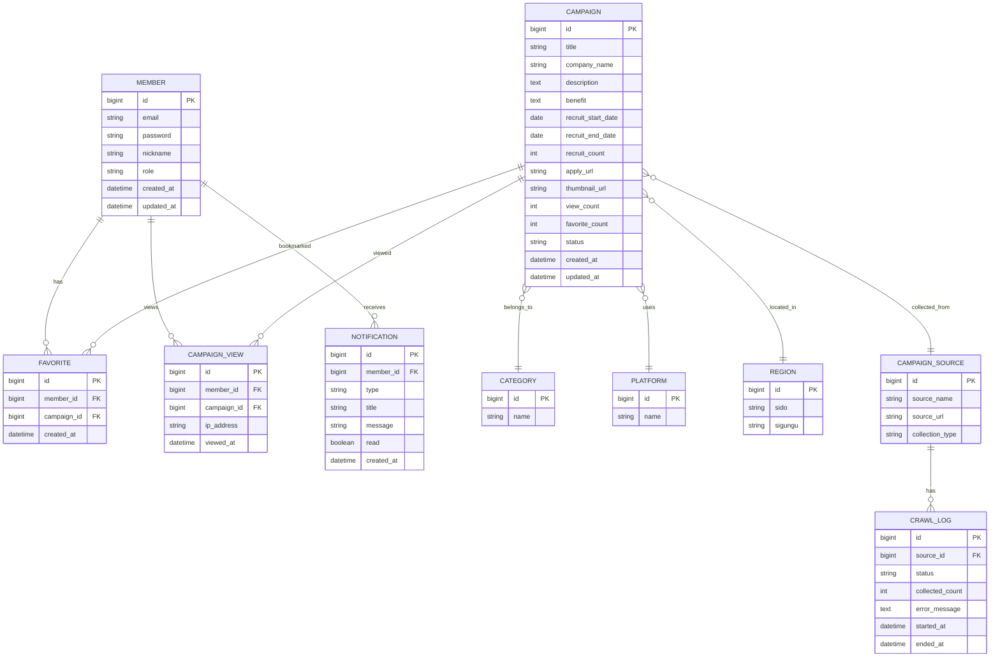

# ERD 초안

## Mermaid ERD

## 테이블 설명

| 테이블 | 설명 |
| --- | --- |
| `member` | 회원 정보 |
| `campaign` | 체험단 모집 정보 |
| `category` | 맛집, 뷰티, 운동, 숙박 등 카테고리 |
| `platform` | 블로그, 인스타그램, 유튜브 등 참여 플랫폼 |
| `region` | 시/도, 시/군/구 지역 정보 |
| `favorite` | 회원별 찜한 체험단 |
| `campaign_view` | 조회 이력 및 추천 데이터 |
| `notification` | 알림 |
| `campaign_source` | 직접 등록 또는 외부 수집 출처 |
| `crawl_log` | 크롤링 실행 로그 |

## Campaign 상태값

| 상태 | 설명 |
| --- | --- |
| `OPEN` | 모집 중 |
| `CLOSED` | 모집 종료 |
| `HIDDEN` | 관리자에 의해 숨김 처리 |

## Member 권한

| 권한 | 설명 |
| --- | --- |
| `USER` | 일반 회원 |
| `ADMIN` | 관리자 |

